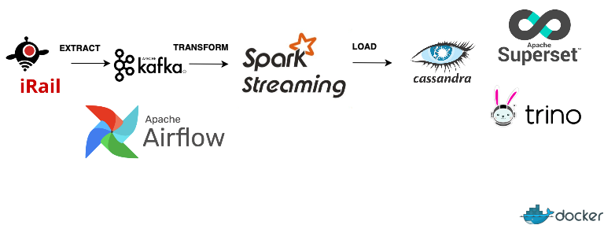

# Учебный проект по итогам курса Data Engineer

## Основная информация

**Цель** - создать конвейер данных для мониторинга расписания поездов.

**Схема**
 

**Источник данных** - https://docs.irail.be/#liveboard

## Описание выполнения

Реализовано на 3 виртуальных машинах

Устанавливаем и запускаем docker на всех вм (Ubuntu 20.04)
https://docs.docker.com/engine/install/ubuntu/

 1. [Cassandra-Trino](#titlecasstrino)
 2. [Airflow-Kafka-Spark](#titleairflowkafkaspark)
 3. [Superset](#titlesuperset)

## <a id="titlecasstrino">**1. Cassandra-Trino**</a>

**TRINO**

Устанавливаем и конфигурируем trino:

###
	docker run --name trino -d -p 8080:8080 trinodb/trino

###
	vi railway.properties

###
	# Insert your_vm_cass_trino_IP into cassandra.contact-points
	connector.name=cassandra
	cassandra.contact-points=your_vm_cass_trino_IP_here
	cassandra.load-policy.dc-aware.local-dc=datacenter1
	cassandra.username=cassandra
	cassandra.password=cassandra

###
	vi config.properties

###
	http-server.authentication.type=PASSWORD

###
	vi password-authenticator.properties

###
	password-authenticator.name=file
	file.password-file=password.db

###
	apt install apache2-utils -y

###
	touch password.db

###
	htpasswd -B -C 10 password.db admin

###
	docker cp railway.properties trino:/etc/trino/catalog/
	docker cp config.properties trino:/etc/
	docker cp password-authenticator.properties trino:/etc/
	docker cp password.db trino:/etc/
				
###
	docker restart trino

**CASSANDRA**

Запускаем cassandra:

###
	vi docker-compose.yml

###
	version: '1.0'
	services:
	  cassandra:
	    image: cassandra:latest
	    container_name: cassandra
	    hostname: cassandra
	    ports:
	      - 9042:9042
	    environment:
	      - MAX_HEAP_SIZE=512M
	      - HEAP_NEWSIZE=100M
	      - CASSANDRA_USERNAME=cassandra
	      - CASSANDRA_PASSWORD=cassandra
	      - CASSANDRA_RPC_ADDRESS=0.0.0.0
	    volumes:
	      - ./:/home
	      - cassandra-data:/var/lib/cassandra
	volumes:
	  cassandra-data:

###
	docker compose -f docker-compose.yml up -d

Заходим в cassandra
###
	docker exec -it cassandra /bin/bash
	cqlsh -u cassandra -p cassandra

Создаем key-space railway и table liveboard:
###
	CREATE KEYSPACE IF NOT EXISTS railway WITH replication = {'class':'SimpleStrategy','replication_factor':1};

###
	CREATE TABLE railway.liveboard(
	loaded_at timestamp,
	timestamp timestamp,
	id text,
	name text,
	locationx float,
	locationy float,
	vehicle text,
	platform text,
	idarr text,
	namearr text,
	locationxarr float,
	locationyarr float,
	delayarr int,
	timearr timestamp,  
	iddep text,
	namedep text,
	locationxdep float,
	locationydep float,
	delaydep int,
	timedep timestamp,
	loaded_at_df timestamp, - убрать?
	primary key (timestamp, id, vehicle),
	);

###
	select count(*) from railway.liveboard;

## <a id="titleairflowkafkaspark">**2. Airflow-Kafka-Spark**</a>

Клонируем репозиторий:
###
	git clone https://github.com/VeraSobal/data-engineering-project-kafka-spark-cassandra.git
	cd data-engineering-project-kafka-spark-cassandra
 

>&vdash;&nbsp;README.md 
>&vdash;airflow 
>&nbsp;&nbsp;&nbsp;&nbsp;&nbsp;&nbsp;&vdash;dags 
>&nbsp;&nbsp;&nbsp;&nbsp;&nbsp;&nbsp;&nbsp;&nbsp;&nbsp;&nbsp;&nbsp;&nbsp;&vdash;&nbsp;*dag_api_kafka_spark_cass.py* 
>&vdash;&nbsp;src 
>&nbsp;&nbsp;&nbsp;&nbsp;&nbsp;&nbsp;&vdash;&nbsp;*kafka_spark_cass.py* 
>&nbsp;&nbsp;&nbsp;&nbsp;&nbsp;&nbsp;&vdash;&nbsp;*constants.py* 
>&vdash;&nbsp;resources 
>&vdash;&nbsp;requirements.txt 
>&vdash;&nbsp;Dockerfile.airflow 
>&vdash;&nbsp;docker-compose-airflow.yml 
>&vdash;&nbsp;docker-compose.yml 

 
Скачиваем необходимые ресурсы:

###
	curl -o resources/spark-cassandra-connector_2.12-3.4.1.jar https://repo1.maven.org/maven2/com/datastax/spark/spark-cassandra-connector_2.12/3.4.1/spark-cassandra-connector_2.12-3.4.1.jar
	curl -o resources/spark-sql-kafka-0-10_2.12-3.4.1.jar https://repo1.maven.org/maven2/org/apache/spark/spark-sql-kafka-0-10_2.12/3.4.1/spark-sql-kafka-0-10_2.12-3.4.1.jar
	curl -o resources/kafka-clients-3.4.1.jar https://repo1.maven.org/maven2/org/apache/kafka/kafka-clients/3.4.1/kafka-clients-3.4.1.jar
	curl -o resources/spark-token-provider-kafka-0-10_2.12-3.4.1.jar https://repo1.maven.org/maven2/org/apache/spark/spark-token-provider-kafka-0-10_2.12-3.4.1.jar
	curl -o resources/commons-pool2-2.12.0.jar https://repo1.maven.org/maven2/org/apache/commons/commons-pool2/2.12.0/commons-pool2-2.12.0.jar
	curl -o resources/spark-cassandra-connector-assembly_2.12-3.4.1.jar https://repo1.maven.org/maven2/com/datastax/spark/spark-cassandra-connector-assembly_2.12/3.4.1/spark-cassandra-connector-assembly_2.12-3.4.1.jar

Создаем сети:

###
	docker network create default_net
	docker network create kafka-network

Запускаем контейнеры c Airflow, Kafka+Spark:

###
	docker build -f Dockerfile.airflow -t build_airflow .
		
###
	echo -e "AIRFLOW_UID=$(id -u)\nAIRFLOW_PROJ_DIR=\"./airflow\"" > .env
		
###
	docker compose -f docker-compose-airflow.yml up -d
		
###
	docker compose -f docker-compose.yml up -d

**KAFKA:**

Создаем topic liveboard, уменьшаем время хранения до 1 дня:

###
	docker exec -ti kafka1  kafka-topics --create --topic liveboard --replication-factor 3 --partitions 3 --bootstrap-server kafka1:19092, kafka2:19093, kafka3:19094
###
	docker exec -it kafka1 kafka-configs --bootstrap-server kafka1:19092,kafka2:19093,kafka3:19094 --alter --entity-type topics --entity-name liveboard --add-config 'retention.ms=86400000'

**AIRFLOW**

Заходим в UI Airflow:  
*localhost:8080*  
user - *airflow*  
password - *airflow*  

Создаем connection:

> Airflow UI > Admin > Сonnections

`Connection Id: spark_master` 
`Connection Type: Spark` 
`Host: local[2]` 

`Connection Id: kafka3` 
`Connection Type: Apache Kafka` 
`Config Dict: {"bootstrap.servers": "kafka1:19092,kafka2:19093,kafka3:19094",` 
`		"security.protocol": "PLAINTEXT"}` 

`Connection Id: irail_liveboard` 
`Connection Type: HTTP` 
`Description: Liveboard provides real-time informations on arriving and departing trains for every Belgian station. /liveboard/{?id,station,date,time,arrdep,lang,format,alerts}` 
`Host: https://api.irail.be/liveboard/` 

Создаем список переменных (id станций, по которым будет осуществляться мониторинг и cassandra host):

> Airflow UI > Admin > Variables

`Key: station_list` 
`Val: ["BE.NMBS.008813003", "BE.NMBS.008814001", "BE.NMBS.008841004", "BE.NMBS.008821006", "BE.NMBS.008892007", "BE.NMBS.008812005", "BE.NMBS.008894201", "BE.NMBS.008822004", "BE.NMBS.008843158", "BE.NMBS.008819406"]` 
`Description:  
Brussels-Central: BE.NMBS.008813003,
Brussels-South: BE.NMBS.008814001,
Liège-Guillemins: BE.NMBS.008841004,
Antwerp Central: BE.NMBS.008821006
Ghent-Sint-Pieters: BE.NMBS.008892007
Brussels-North: BE.NMBS.008812005
Lokeren: BE.NMBS.008894201
Mechelen: BE.NMBS.008822004
Charleroi-Sud: BE.NMBS.008843158
Brussels Airport - Zaventem: BE.NMBS.008819406 ` 

`Key: cassandra_host` 
`Val: "your_vm_cass_trino_IP_here"` 

Запускаем kafka_spark_cass_dag (запускает spark-submit со стримингом), api_kafka_dag (переносит данные api в kafka каждую минуту).

## <a id="titlesuperset">**3. Superset**</a>

Получаем your_secret_key_here:
###
	openssl rand -base64 42

Запускаем superset:
###
	sudo docker run -d -p 8080:8088 -e "SUPERSET_SECRET_KEY=your_secret_key_here" --name superset apache/superset

###
	sudo docker exec -it superset superset fab create-admin \
	          --username admin \
	          --firstname Superset \
	          --lastname Admin \
	          --email admin@superset.com \
	          --password admin

###
	sudo docker exec -it superset superset db upgrade
###
	sudo docker exec -it superset superset init

Устанавливаем драйвер trino
###
	docker exec -it superset /bin/bash -c "pip install trino"
###
	docker restart superset

Заходим в UI Superset:  
*localhost:8080*  
user - *admin*  
password - *admin*  

> Superset UI > "+" > Data > trino

Connection string:
###
	trino://admin:@your_vm_cass_trino_IP_here:8080/railway

Загружаем дашборд:
###
	curl -o dashboard_liveboard.zip https://raw.githubusercontent.com/VeraSobal/data-engineering-project-kafka-spark-cassandra/main/dashboard_liveboard.zip
	docker cp dashboard_liveboard.zip superset:/tmp/dashboard_liveboard.zip
	docker exec -it superset /bin/bash -c "superset import_dashboards -p /tmp/dashboard_liveboard.zip -u 'admin'"

##

&#9745; Готово!

